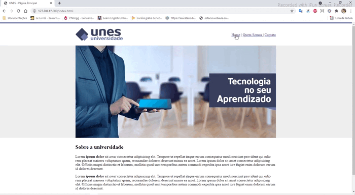
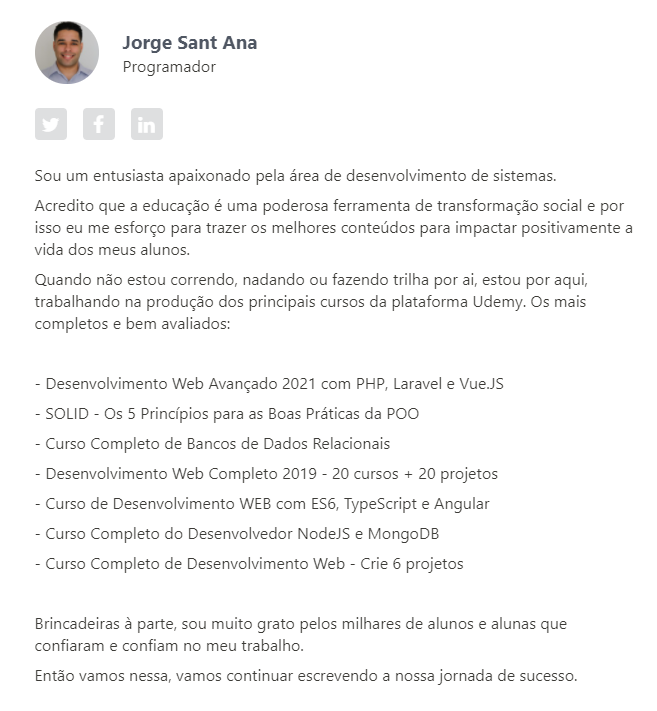

# Projeto: Web Site Universidade

### Objetivo

Aplicar os conhecimentos básicos de HTML para a criação de um web site.

[Link](https://araujoleonardo310.github.io/Projeto_WebSite_Universidade/)

### Ferramentas & Softwares Usados

 - Visual Studio Code
 - Git 
 - GitHub
 - Imagens (disponibilizadas pelo curso)

### Foco de Habilidaddes Adquiridas

* Títulos
* Tabelas
* Formularios
* Links

### Referências & Créditos

[Desenvolvimento Web Completo 2021 - 20 cursos + 20 projetos](https://www.udemy.com/share/101WqG2@PW5KVFhYTlIJekRCO2JOVBRu/)

	

